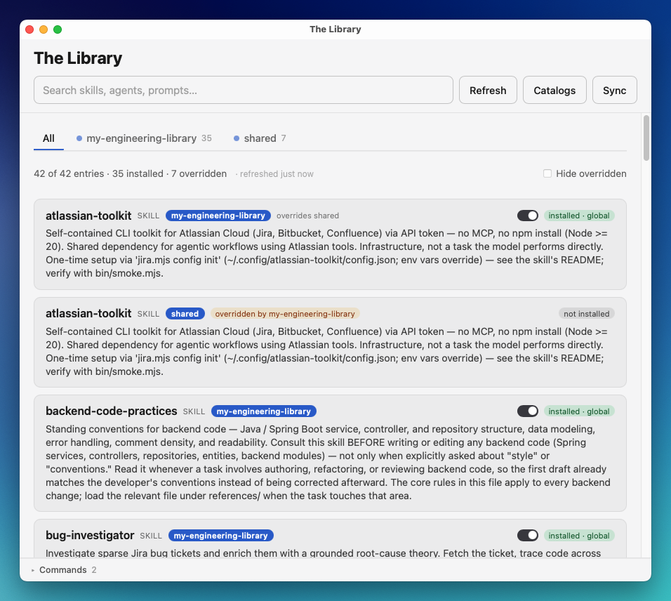
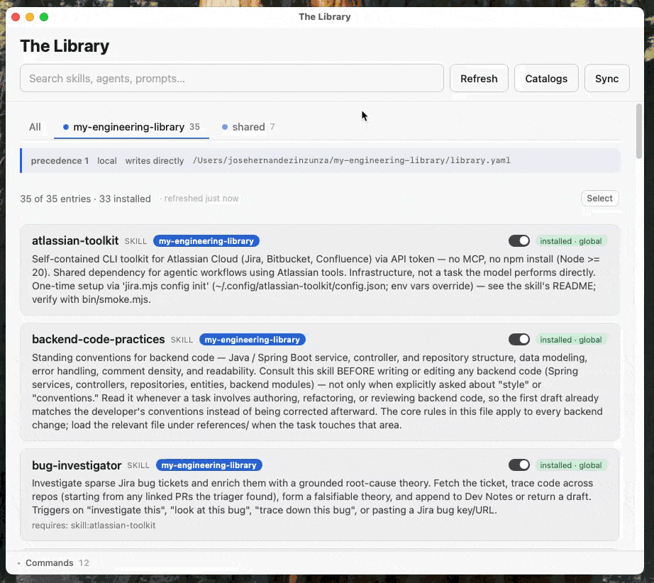
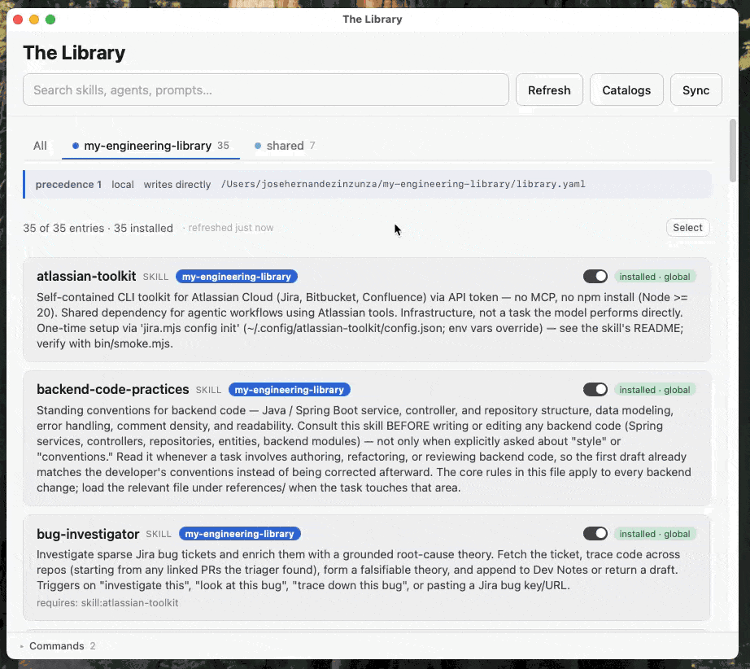

# The Library

A meta-skill for private-first distribution of agentics (skills, agents, and prompts) across agents, devices, and teams.


## Who This Is For

If you're an engineer working on 10+ codebases with agents and you're building specialized private skills, agents, and prompts — this was made for you.

If you work in one or two repos, you don't need this. If you install skills from the public internet without reviewing them, this isn't for you either.

The Library solves a specific problem: you've built powerful agentics scattered across repos, devices, and teams. They're duplicated, out of sync, and hard to coordinate. This gives you a single reference catalog to distribute them privately.

For the full pitch and the design behind it — what the catalog looks like, why it's built
this way — see **[docs/concepts.md](docs/concepts.md)**.

---

## Start Here: The Desktop App

For most people this is the way in: a native macOS app over the same catalog and the same
`library.py`, so browsing, installing, and setting up a skill never needs a terminal.



Every catalog at a glance, with install state, scope, catalog origin, and override badges on each
entry. Search filters the loaded list instantly, and offline.

### See exactly what installs, before it installs



Pick a skill and the app previews every file it would write — the skill itself plus the
dependencies it pulls in — before anything touches disk. Install, and the entry's badge flips to
installed.

### Switch a skill off without uninstalling it



Flip the switch and the skill stops loading without leaving your machine — switching it back on is
a move, not a re-fetch. A `disabled` tab appears at the end of the strip, so what you have parked
stays findable instead of vanishing from the list. Claude Code reads its skills when a session
starts, so the change lands in your next session rather than one you already have open, and the app
says so rather than letting you find out.

### Get it

Build it once from your own clone, then launch it like any Mac app:

```bash
git clone <this-repo> && cd the-library-skill
just app-setup      # npm install
just app-install    # build, then copy into /Applications
```

Building needs **just**, **Node ≥ 20**, and the **Rust toolchain** (Tauri's backend compiles
from source), so the first build takes several minutes. `just app-prereqs` checks Node, Rust,
and Python in one go and names the fix for whichever is missing. If you install Rust as part
of this, run `source "$HOME/.cargo/env"` or open a new terminal before building — the
installer cannot put `cargo` on the `PATH` of a shell that is already running. The app prompts
you through the rest — bootstrapping the CLI and registering your catalog are both first-run
screens, not prerequisites you satisfy beforehand.

**→ Full setup, what it does, and the guided-setup walkthrough that configures a
credentialed skill without the secret ever entering the agent's context:
[desktop/README.md](desktop/README.md)**

---

## Prefer the Terminal?

The app is a **thin client** over a CLI that has two other front doors, all reading the same
catalog:

- **The agent** (Claude Code, Pi, any harness that reads skill files) — natural language for
  the fuzzy parts: vague names, dependency detection, source resolution, confirmations.
- **The CLI** (`./library …`) — deterministic, no LLM, no tokens. The read-mostly commands
  run instantly, and scripts and CI drive it directly.

The 30-second version:

```bash
git clone <this-repo> && cd the-library-skill
python3 bootstrap.py                                  # one-time: .venv + PyYAML
./library link                                        # → ~/.claude/skills/library
./library init --repo <catalog-url> --branch <branch> # point at your team's catalog
./library list                                        # confirm you can see it
```

Then either ask your agent (`/library use the deploy skill`) or run it yourself
(`./library use deploy`).

**→ Prerequisites, the full seven steps, and the agent-guided alternative:
[docs/install.md](docs/install.md)**

---

## Documentation

| Doc | What's in it |
| --- | --- |
| **[desktop/README.md](desktop/README.md)** | The desktop app: prerequisites, install, what it does, guided setup walkthroughs |
| **[docs/install.md](docs/install.md)** | CLI + agent setup, start to finish |
| **[docs/workflows.md](docs/workflows.md)** | The full loop, worked: build → catalog → distribute → use |
| **[docs/commands.md](docs/commands.md)** | Every command, both front doors, plus flags and `just` shortcuts |
| **[cookbook/](cookbook/)** | A step-by-step guide per command — the deepest per-command reference |
| **[docs/catalogs.md](docs/catalogs.md)** | Personal catalogs, precedence and overriding, where writes and installs land |
| **[docs/reference.md](docs/reference.md)** | File formats: the catalog, per-device config, install receipts, source formats, repo layout |
| **[docs/concepts.md](docs/concepts.md)** | What it is, why it exists, design principles, the agentic stack |
| **[docs/troubleshooting.md](docs/troubleshooting.md)** | Symptom → fix, plus auth and setup gotchas |
| **[docs/contributing.md](docs/contributing.md)** | Working on the tool or maintaining a catalog |
| **[docs/roadmap.md](docs/roadmap.md)** | Deferred work and feature requests, each with why it isn't done yet |

## Troubleshooting

Most issues are catalog health — the fastest triage is `./library doctor` (add `--deep` to
also check that every source repo/branch is reachable). The full symptom → fix table, plus
auth/setup gotchas, lives in **[docs/troubleshooting.md](docs/troubleshooting.md)**.

## Contributing

Working on the tool, or maintaining a catalog? See **[docs/contributing.md](docs/contributing.md)**.
The short version: run `just check` before pushing (Python compile + doc/CLI drift + tests), enable
the pre-push hook once with `just install-hooks`, and let catalog integrity (`doctor`) run in
CI on the catalog repo.

Got an idea, or a feature you want that isn't here? **[docs/roadmap.md](docs/roadmap.md)** is
where deferred work and feature requests are collected, each with what it is, why it isn't
being done now, and what it would unlock.
